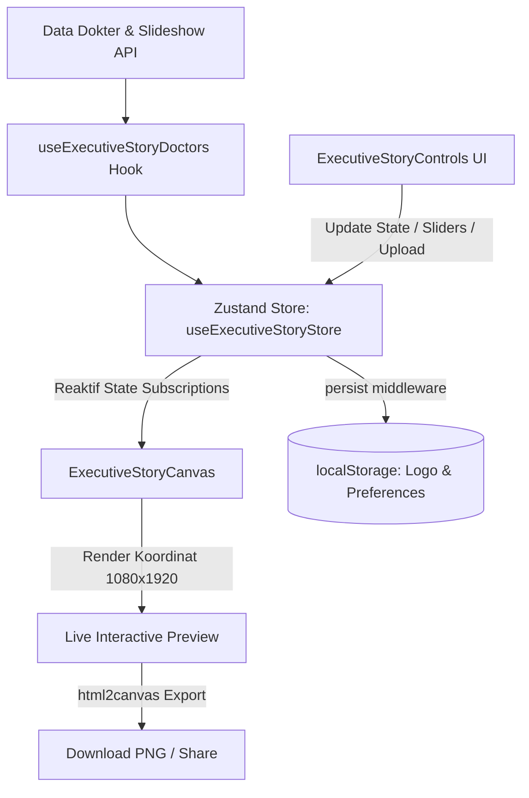

# Architecture & Development Guide — Executive Story Generator

Dokumentasi arsitektur sistem, struktur modul, manajemen state (**Zustand**), dan panduan pengembangan lanjutan untuk **Graphicat Executive Story Generator (RSU Siloam)**.

---

## 1. Ringkasan Proyek & Tujuan (Project Overview)

**Executive Story Generator** adalah modul berbasis web modern yang dirancang untuk menghasilkan poster jadwal dokter spesialis dalam format **Instagram Story (1080 × 1920 px, 9:16)** dan **Instagram Post / Square (1080 × 1080 px, 1:1)** berkualitas tinggi dengan tipografi profesional, foto dokter beresolusi tinggi, dan branding rumah sakit.

---

## 2. Tech Stack & Dependensi Utama

| Kategori | Teknologi | Fungsi Utama |
| :--- | :--- | :--- |
| **Framework & Build** | React 19 + Vite 7 | Reaktivitas instan, Hot Module Replacement (HMR), bundle modern |
| **State Management** | **Zustand** (`zustand/middleware`) | Global store tanpa re-render berlebih, persistence ke `localStorage` |
| **Routing** | React Router v7 | Navigasi halaman aplikasi |
| **Styling** | Tailwind CSS + Fixed Pixel System | Penataan layout presisi berbasis koordinat 1080 × 1920 px |
| **Media & Asset** | Cloudinary REST API | Pengunggahan logo kustom & foto dokter transparan |
| **Ekspor Gambar** | `html2canvas` | Konversi elemen DOM ke format PNG resolusi tinggi (skala 2x) |
| **Ikonografi** | `lucide-react` | Ikon UI modern & visual kanvas |

---

## 3. Struktur Direktori Proyek

```text
react-migrated/
├── public/
│   └── asset/
│       ├── logo/            # Logo Siloam, MySiloam, Graphicat
│       └── webp/            # Asset foto dokter lokal (fallback)
├── src/
│   ├── components/
│   │   └── ExecutiveStory/
│   │       ├── ExecutiveStoryCanvas.jsx     # Engine render kanvas 1080x1920
│   │       ├── ExecutiveStoryControls.jsx   # Panel kontrol & akordion sidebar
│   │       └── ExecutiveStoryPage.jsx       # Layout halaman utama generator
│   ├── context/
│   │   └── ExecutiveStoryContext.jsx        # Adapter jembatan ke Zustand store
│   ├── hooks/
│   │   └── useExecutiveStoryDoctors.js      # Normalisasi data dokter & Slideshow
│   ├── store/
│   │   └── useExecutiveStoryStore.js        # Global State Store (Zustand)
│   ├── utils/
│   │   ├── cloudinaryUpload.js              # Pipeline upload ke Cloudinary
│   │   └── imageHelper.js                   # Helper slug nama, inisial & jadwal
│   ├── App.jsx                              # Router & rute halaman
│   └── main.jsx                             # Entry point aplikasi
├── architecture.md                          # Panduan arsitektur sistem
└── package.json
```

---

## 4. Arsitektur State Management (Zustand)

Manajemen state aplikasi dikelola secara terpusat oleh **Zustand** pada `src/store/useExecutiveStoryStore.js`.

### Diagram Alur Data (Data Flow):



### Struktur State Utama:
```javascript
{
  selectedDoctor: null,       // Objek data dokter yang sedang dipilih
  config: {
    theme: 'white-gold',      // 'white-gold' | 'royal-navy-gold' | 'onyx-gold' | 'emerald-luxury' | 'siloam-blue'
    format: 'story',          // 'story' (1080x1920) | 'square' (1080x1080)
    
    // Layout Offsets & Spacing
    tagOffsetY: 0,            // Offset posisi badge atas
    headerOffsetY: 0,         // Offset posisi judul
    doctorCardOffsetY: 0,     // Offset posisi kartu dokter
    scheduleOffsetY: 0,       // Offset posisi tabel jadwal
    scheduleGap: 40,          // Jarak (gap) antar kartu jadwal & reservasi

    // Doctor Card Customization
    doctorCardScale: 1.0,     // Skala zoom kartu dokter (70% - 140%)
    doctorNameFontSize: 0,    // Ukuran font nama dokter (0 = Auto)
    doctorSpecialtyFontSize: 0,// Ukuran font spesialisasi (0 = Auto)
    doctorNameColor: '',      // Kustom warna font nama
    doctorSpecialtyColor: '', // Kustom warna font spesialisasi

    // Photo Controls
    photoScale: 1.0,          // Skala foto dokter (70% - 160%)
    photoOffsetY: 0,          // Posisi vertikal foto
    photoOffsetX: 0,          // Posisi horizontal foto
    photoFlipX: false,        // Cermin foto horizontal (Mirroring)

    // Top-Left Logo Customization
    customLogoUrl: '',        // URL Cloudinary logo kustom
    logoScale: 1.0,           // Skala zoom logo (40% - 250%)
    logoOffsetX: 0,           // Offset horizontal logo
    logoOffsetY: 0,           // Offset vertikal logo

    // Typography Custom Colors
    customTitleColor: '',     // Warna font judul utama
    customScheduleTextColor: '', // Warna font teks jadwal praktik
  }
}
```

---

## 5. Sistem Render Kanvas & Layout Engine

Kanvas bekerja pada sistem koordinat statis tetap **1080 × 1920 px** yang diskalakan secara visual menggunakan CSS `transform: scale(zoom)` pada layar preview, sehingga hasil download PNG selalu menghasilkan resolusi asli tanpa penurunan kualitas.

### Aturan Komposisi (Art-Direction Rules):
1. **Asymmetric 45/55 Split**:
   * Sisi Kiri (45%): Kolom teks informasi (Logo, Badge Eyebrow, Judul Utama, Kartu Dokter Emas, Tabel Jadwal, Pendaftaran).
   * Sisi Kanan (55%): Foto dokter berukuran besar sebagai hero visual utama (`width: 580px, height: 1320px`).
2. **Bottom Feather Fade**:
   * Foto dokter menggunakan CSS `mask-image: linear-gradient(to bottom, black 0%, black 86%, rgba(0,0,0,0.95) 90%, rgba(0,0,0,0.70) 94%, rgba(0,0,0,0.35) 97%, transparent 100%)`.
   * Tubuh dokter 100% solid hingga 86% ke bawah, hanya bagian 14% paling bawah yang menyatu lembut ke latar belakang.
3. **Dynamic Schedule Flow**:
   * Tabel jadwal dan kartu reservasi berada dalam satu flex container dengan `gap: scheduleGap`. Hal ini mencegah overlap teks jika dokter memiliki 1 hingga 6 hari jadwal praktik.

---

## 6. Pipeline Upload Cloudinary & Persistensi

* **Unggah Langsung (Direct REST Upload)**:
  `uploadLogoToCloudinary(file)` mengirimkan form data ke `https://api.cloudinary.com/v1_1/de5k1duyb/image/upload` menggunakan upload preset `admin_upload`.
* **Persistensi Pengaturan**:
  Pengaturan logo kustom dan tema disimpan di `localStorage` via Zustand middleware (`persist`), sehingga pengguna tidak perlu mengunggah ulang logo setiap kali membuka aplikasi.

---

## 7. Panduan Pengembangan Lebih Lanjut (Future Roadmap)

Untuk pengembang yang ingin memperluas fungsionalitas aplikasi:

### 1. Batch Story Export (Ekspor Massal)
* **Konsep**: Membuat tombol *"Download Semua Jadwal Dokter"* yang mengekspor seluruh dokter Executive Clinic ke dalam file ZIP berisi file PNG masing-masing dokter.
* **Implementasi**: Gunakan pustaka `jszip` dan loop iteratif render canvas di background.

### 2. Multi-Template Layouts (Variasi Template Poster)
* **Konsep**: Menambahkan pilihan template layout baru (contoh: *Minimalist Modern*, *Split Diagonal*, *Dark Neon Luxury*).
* **Implementasi**: Buat folder `src/components/ExecutiveStory/templates/` dan mapping komponen template berdasarkan `config.templateId`.

### 3. Server-Side Automated Scheduler (Otomasi Harian)
* **Konsep**: Menjalankan bot otomatis (Puppeteer / Chromium headless di Netlify Functions atau GitHub Actions) untuk menghasilkan poster story harian dan otomatis mengirimkannya ke WhatsApp Marketing atau media sosial rumah sakit.

### 4. Integrasi Instagram Direct Publishing
* **Konsep**: Terhubung ke Meta Graph API untuk langsung menerbitkan hasil render story ke akun Instagram resmi rumah sakit tanpa perlu download manual.

---

## 8. Panduan Menjalankan Project

```bash
# Masuk ke direktori react-migrated
cd "d:\story-generator-main2 final\story-generator-main\react-migrated"

# Install dependensi (termasuk zustand)
npm install

# Jalankan server development
npm run dev

# Build untuk produksi
npm run build
```
