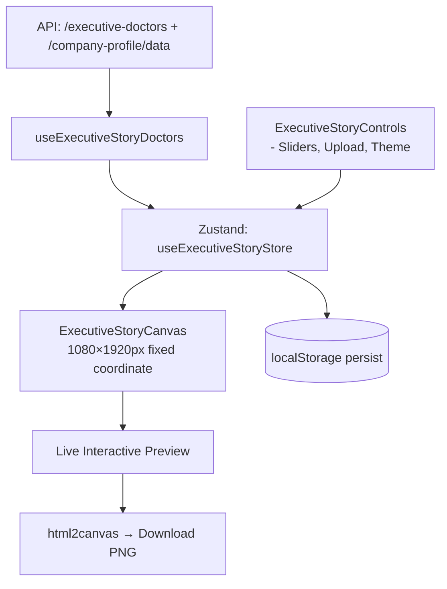
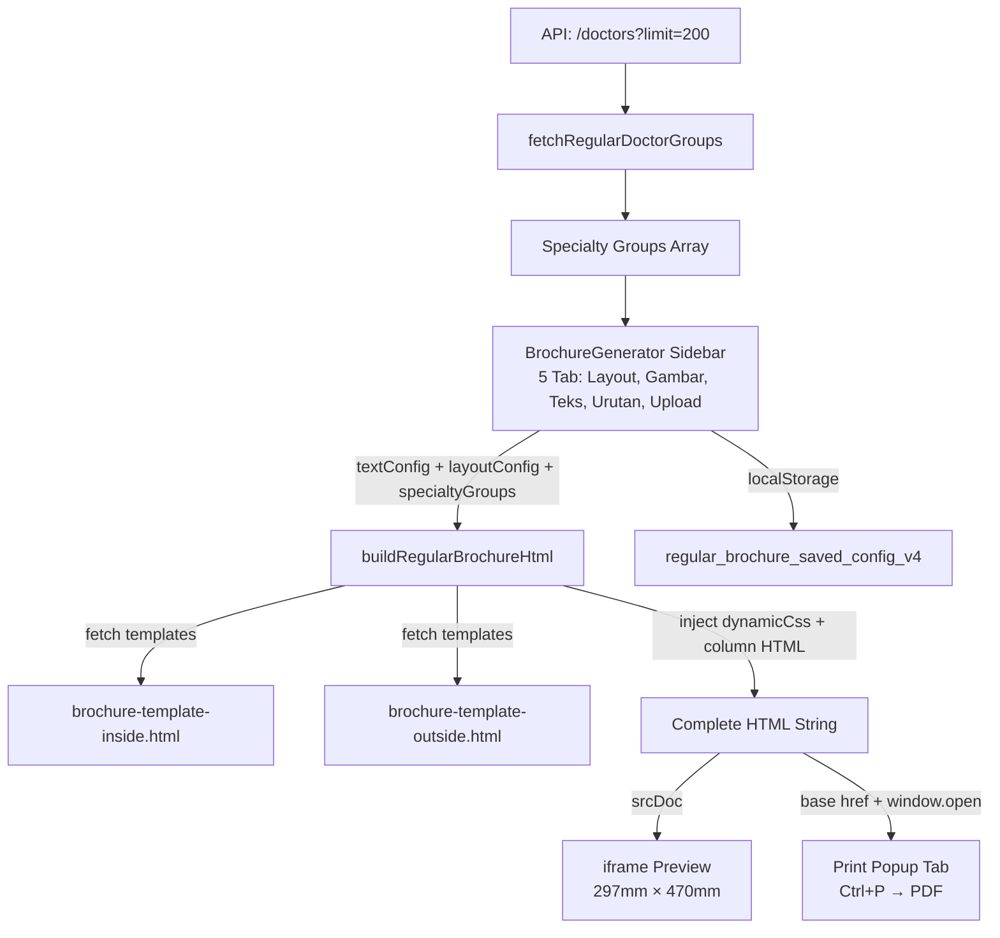

# Architecture & Development Guide
# Graphicat Story Generator — RSU Siloam Ambon

> **Versi Terkini**: v3.0.0 (Agustus 2026)  
> **Maintainer**: Rattputt / RSU Siloam Ambon Dev Team  
> **Stack**: React 19 + Vite 7 + Zustand + Tailwind CSS  
> **Deployed**: Netlify (`dashdev2.netlify.app`) + Local Dev (`localhost:5175`)

---

## Daftar Isi

1. [Ringkasan Proyek](#1-ringkasan-proyek)
2. [Tech Stack](#2-tech-stack)
3. [Struktur Direktori](#3-struktur-direktori)
4. [Routing & Halaman Aplikasi](#4-routing--halaman-aplikasi)
5. [Modul 1: Executive Story Generator](#5-modul-1-executive-story-generator)
6. [Modul 2: Regular Trifold Brochure](#6-modul-2-regular-trifold-brochure)
7. [Modul 3: Executive Bifold Brochure](#7-modul-3-executive-bifold-brochure)
8. [Modul 4: Tarif & WelcomeBoard](#8-modul-4-tarif--welcomeboard)
9. [State Management (Zustand)](#9-state-management-zustand)
10. [Backend API](#10-backend-api)
11. [Sistem Print & PDF](#11-sistem-print--pdf)
12. [Pipeline Gambar & Aset](#12-pipeline-gambar--aset)
13. [Panduan Menjalankan Project](#13-panduan-menjalankan-project)
14. [Panduan Pengembangan Lanjutan](#14-panduan-pengembangan-lanjutan)

---

## 1. Ringkasan Proyek

**Graphicat Story Generator** adalah aplikasi web internal RSU Siloam Ambon yang menyediakan **4 modul generator konten digital** untuk kebutuhan komunikasi dan pemasaran rumah sakit:

| Modul | Path | Fungsi |
|-------|------|--------|
| Story Generator (Legacy) | `/` | Poster jadwal dokter format Instagram Story & Post |
| **Executive Story Generator** | `/executive-story` | Generator poster premium white-gold dengan foto dokter HD |
| **Regular Trifold Brochure** | `/brochure` | Brosur 3 lipat A4 jadwal poliklinik semua dokter spesialis |
| **Executive Bifold Brochure** | `/executive-brochure` | Brosur 2 lipat A4 white-gold khusus Klinik Eksekutif |
| Welcome Board | `/welcome` | Layar selamat datang untuk display TV/monitor lobby |

---

## 2. Tech Stack

| Kategori | Teknologi | Versi | Fungsi |
|----------|-----------|-------|--------|
| **Framework** | React | 19.x | Reaktivitas UI, komponen |
| **Build Tool** | Vite | 7.x | HMR, bundling, dev server |
| **State Global** | Zustand | latest | Store terpusat tanpa boilerplate |
| **Routing** | React Router | v7 | Navigasi antar modul |
| **Styling** | Tailwind CSS + Vanilla CSS | 3.x | Layout utility + custom pixel-perfect |
| **Ikon** | lucide-react | latest | Icon set modern |
| **Export Gambar** | html2canvas | latest | Render DOM ke PNG (Story Generator) |
| **Upload CDN** | Cloudinary REST API | v1 | Upload logo & foto dokter |
| **Deploy** | Netlify | - | Hosting + serverless functions |
| **Font** | Google Fonts (Poppins, Montserrat, Plus Jakarta Sans) | - | Tipografi premium |

---

## 3. Struktur Direktori

```text
react-migrated/
├── public/
│   ├── asset/
│   │   ├── logo/                    # Logo Siloam, MySiloam, Graphicat
│   │   ├── brochure/                # Gambar brosur (1.png, 2.png, 3.png, 4.png)
│   │   └── webp/                    # Foto dokter lokal (fallback dari slug nama)
│   ├── brochure-template-inside.html   # Template HTML brosur 3-lipat (halaman dalam)
│   ├── brochure-template-outside.html  # Template HTML brosur 3-lipat (halaman luar)
│   └── story-template.html             # Template HTML story generator legacy
│
├── src/
│   ├── App.jsx                          # Router utama + semua routes
│   ├── main.jsx                         # Entry point React
│   │
│   ├── components/
│   │   ├── Brochure/
│   │   │   ├── BrochureGenerator.jsx       # ★ Engine Brosur 3-Lipat Reguler
│   │   │   └── ExecutiveBrochureGenerator.jsx # ★ Engine Brosur 2-Lipat Eksekutif
│   │   ├── ExecutiveStory/
│   │   │   ├── ExecutiveStoryCanvas.jsx    # Render kanvas 1080×1920 px
│   │   │   ├── ExecutiveStoryControls.jsx  # Panel kontrol sidebar
│   │   │   └── ExecutiveStoryGenerator.jsx # Layout halaman utama
│   │   ├── Layout/
│   │   │   ├── AdminLayout.jsx             # Shell layout admin (navbar + container)
│   │   │   └── Sidebar.jsx                 # Sidebar story generator legacy
│   │   ├── Preview/
│   │   │   └── Workspace.jsx               # Preview workspace story legacy
│   │   ├── Tarif/
│   │   │   └── TarifApp.jsx                # Modul display tarif layanan
│   │   ├── WelcomeBoard/
│   │   │   └── WelcomeBoard.jsx            # Display selamat datang lobby
│   │   ├── Controls/                        # Komponen input & kontrol reusable
│   │   └── UI/                              # Komponen UI atom (Button, dll.)
│   │
│   ├── context/
│   │   ├── StoryContext.jsx               # Context untuk story generator legacy
│   │   └── ExecutiveStoryContext.jsx      # Adapter bridge → Zustand store
│   │
│   ├── hooks/
│   │   └── useExecutiveStoryDoctors.js    # Fetch & normalisasi data dokter
│   │
│   ├── store/
│   │   └── useExecutiveStoryStore.js      # ★ Zustand global store
│   │
│   └── utils/
│       ├── brochureBuilder.js             # ★ Engine HTML generator brosur
│       ├── cloudinaryUpload.js            # Upload gambar ke Cloudinary
│       ├── downloadHelper.js              # Helper export PNG
│       ├── helpers.js                     # Utilitas umum
│       └── imageHelper.js                 # Slug nama, inisial, foto dokter
│
├── architecture.md                        # Dokumentasi ini
├── CHANGELOG.md                           # Riwayat perubahan
├── package.json
├── vite.config.js
├── tailwind.config.js
└── netlify.toml
```

---

## 4. Routing & Halaman Aplikasi

```text
/                    → Story Generator Legacy (Doctor Card + Instagram Post/Story)
/executive-card      → Executive Story Generator (alias)
/executive-story     → Executive Story Generator (Premium White-Gold Poster)
/brochure            → Regular Trifold Brochure Generator
/executive-brochure  → Executive Bifold Brochure Generator (White-Gold Theme)
/welcome             → Welcome Board Display
```

Semua route dibungkus oleh `<AdminLayout>` yang menyediakan navigasi top bar antar modul.

---

## 5. Modul 1: Executive Story Generator

**Path**: `/executive-story` | `/executive-card`  
**Files**: `src/components/ExecutiveStory/` + `src/store/useExecutiveStoryStore.js`

### Alur Render:


### State Utama (Zustand):
```javascript
{
  selectedDoctor: null,
  config: {
    theme: 'white-gold',        // white-gold | royal-navy-gold | onyx-gold | emerald-luxury | siloam-blue
    format: 'story',            // story (1080×1920) | square (1080×1080)
    tagOffsetY: 0,
    headerOffsetY: 0,
    doctorCardOffsetY: 0,
    scheduleOffsetY: 0,
    scheduleGap: 40,
    doctorCardScale: 1.0,
    doctorNameFontSize: 0,      // 0 = auto
    photoScale: 1.0,
    photoOffsetY: 0,
    photoOffsetX: 0,
    photoFlipX: false,
    customLogoUrl: '',
    logoScale: 1.0,
    logoOffsetX: 0,
    logoOffsetY: 0,
    customTitleColor: '',
    customScheduleTextColor: ''
  }
}
```

### Sistem Layout Kanvas (1080 × 1920 px):
- **Asymmetric 45/55 Split**: Kiri = teks info, Kanan = foto hero besar
- **Bottom Feather Fade**: `mask-image` gradient agar foto menyatu ke background
- **Dynamic Schedule Flow**: flex container dengan `gap: scheduleGap` agar tidak overlap

---

## 6. Modul 2: Regular Trifold Brochure

**Path**: `/brochure`  
**Files**: 
- `src/components/Brochure/BrochureGenerator.jsx` — UI React (5 tab sidebar)
- `src/utils/brochureBuilder.js` — Engine HTML generator
- `public/brochure-template-inside.html` — Template halaman dalam
- `public/brochure-template-outside.html` — Template halaman luar

### Alur Kerja:



### Column Distribution Algorithm:

```
4 Kolom layout:
  Column 0 → Outside Left Panel (halaman luar, panel kiri)
  Column 1 → Inside Left Panel  (halaman dalam, panel kiri — height berkurang karena ada header)
  Column 2 → Inside Middle Panel (halaman dalam, panel tengah)
  Column 3 → Inside Right Panel  (halaman dalam, panel kanan)

Kalkulasi tinggi per elemen:
  - Header group = titleFontSize + 5 + specialtySpacing (px)
  - Doctor card   = nameHeight + pillLines × (scheduleFontSize + 7) + cardPadding×2 + cardMargin + 3

Kapasitas kolom:
  columnUsableHeight = 770 - (panelPaddingY × 2) px
  Column 1 dikurangi headerHeight (karena ada judul utama di sana)

Distribusi:
  1. Hitung total tinggi semua data
  2. Bagi secara proporsional ke 4 kolom
  3. Jika grup tidak muat: split dokter ke "(Lanjutan)" di kolom berikutnya
```

### Sidebar Tab System (5 Tab):

| Tab | Fungsi |
|-----|--------|
| **Layout** | Scale (globalScale), Geser X/Y, Jarak Head & Sub-head, Margin Header, Spacing Spesialis, Spacing Kartu, Font Sizes |
| **Gambar** | Gambar 2 (BG Cover): Scale, Geser X/Y, Opacity. Gambar 3 (Mockup HP): Scale, Geser X/Y. Gambar 1 (Cover Depan): Scale, Geser X/Y |
| **Teks** | Edit semua teks: Judul utama, Subtitle, Tanggal update, Nama RS, Alamat, Telepon, Cover title, dll. |
| **Urutan** | Drag-order (Up/Down) spesialis dan dokter. Toggle visibilitas per dokter |
| **Upload** | Upload kustom: Logo, Gambar 1 (Cover), Gambar 2 (BG), Gambar 3 (Mockup) |

### Dynamic CSS Injection (Print-Safe):

```javascript
// brochureBuilder.js
const sc = layout.globalScale / 100; // Scale multiplier

// TIDAK pakai zoom CSS (tidak reliable di Firefox print)
// Semua nilai di-scale langsung:
.doctor-name { font-size: ${layout.doctorFontSize * sc}px !important; }
.doctor-card { padding: ${layout.cardPadding * sc}px ... !important; }
// dst.

// @media print explicit block:
@media print {
    .trifold-sheet { transform: translate(${offsetX}px, ${offsetY}px) !important; }
    .cover-bg-layer { transform: translate(...) scale(...) !important; }
}
```

### Preview Rendering (iframe Isolated):

```jsx
// BrochureGenerator.jsx
// Menggunakan <iframe srcDoc> bukan dangerouslySetInnerHTML
// Alasan: HTML template berisi <html><head>@page rules yang bisa bocor ke React DOM
<iframe
    srcDoc={previewHtml}
    style={{ width: '297mm', height: '470mm' }}
    scrolling="yes"
/>
```

### Print Flow (Base URL Fix):

```javascript
// Popup tab = about:blank, tidak bisa resolve relative URL
// Fix: inject <base href> sebelum menulis ke popup
const baseUrl = window.location.origin; // 'http://localhost:5175'
const htmlWithBase = htmlContent.replace('<head>', `<head><base href="${baseUrl}/">`);
printWindow.document.write(htmlWithBase);
```

### Persistensi Config:

```javascript
// localStorage key: 'regular_brochure_saved_config_v4'
{
  textConfig: {...},
  layoutConfig: {...},
  specialtyGroups: [...],
  coverUrl: '...',
  bgUrl: '...',
  logoUrl: '...',
  image3Url: '...',
  savedAt: 'HH:MM, DD MMM YYYY'
}
```

---

## 7. Modul 3: Executive Bifold Brochure

**Path**: `/executive-brochure`  
**Files**: `src/components/Brochure/ExecutiveBrochureGenerator.jsx`  
**Theme**: White-Gold Bifold — tampilan premium untuk Klinik Eksekutif

### Perbedaan dari Regular Brochure:

| Aspek | Regular Trifold | Executive Bifold |
|-------|----------------|-----------------|
| Layout | 3-panel (3 lipatan) A4 Landscape | 2-panel (2 lipatan) A4 Landscape |
| Tema | Clean corporate blue | White-Gold premium luxury |
| Foto Dokter | Tidak ada | Ada (circular photo dari Cloudinary/SSTV) |
| Panel | 99mm × 210mm × 3 | 148.5mm × 210mm × 2 |
| Logo | Upload manual | Dari database company-profile |
| Engine | Template HTML external | Inline HTML generation |
| Sidebar | 5 tab | Terpisah, lebih compact |

### Data Sources Executive:
```
1. GET /executive-doctors/grouped  → Data grup dokter eksekutif (utama)
2. GET /company-profile/data        → Foto & logo dari database
3. GET /doctors?limit=200           → Jadwal fallback dari data reguler
```

### Photo Resolution Chain:
```
1. photoMap[cleanDoctorName(doc.name)]   → cocok exact dari company-profile
2. photoMap fuzzy match                  → jika nama sedikit berbeda
3. photoMap[slug-${createDoctorSlug}]   → cocok via slug
4. doc.image_url                         → langsung dari response API
5. /asset/webp/${slug}.webp              → foto lokal fallback
```

---

## 8. Modul 4: Tarif & WelcomeBoard

**Tarif** (`/tarif`): Display tarif layanan rumah sakit. Static page.

**WelcomeBoard** (`/welcome`): 
- Display TV/monitor di lobby rumah sakit
- Slideshow foto dokter yang sedang bertugas hari itu
- Auto-refresh data jadwal setiap interval tertentu

---

## 9. State Management (Zustand)

File: `src/store/useExecutiveStoryStore.js`

```javascript
import { create } from 'zustand';
import { persist } from 'zustand/middleware';

// Digunakan oleh ExecutiveStoryGenerator
const useExecutiveStoryStore = create(
  persist(
    (set, get) => ({
      selectedDoctor: null,
      config: { theme: 'white-gold', format: 'story', ... },
      setSelectedDoctor: (doc) => set({ selectedDoctor: doc }),
      updateConfig: (key, val) => set(state => ({ config: { ...state.config, [key]: val } })),
    }),
    { name: 'executive-story-store' } // localStorage key
  )
);
```

Untuk modul Brochure, state dikelola via React `useState` lokal + `localStorage` manual (bukan Zustand).

---

## 10. Backend API

**Base URL**: `https://dashdev2.netlify.app/.netlify/functions/api`

| Endpoint | Method | Fungsi |
|----------|--------|--------|
| `/doctors?limit=200` | GET | Semua data dokter reguler dengan jadwal |
| `/executive-doctors/grouped` | GET | Dokter eksekutif dikelompokkan per spesialis |
| `/company-profile/data` | GET | Data RS, foto dokter, logo dari CMS |

### Data Normalisasi Jadwal:

```javascript
// extractDoctorScheduleEntries(scheduleObj)
// Input: { senin: '08:00-14:00', selasa: '14:00-18:00', ... }
// Output: [{ day: 'Senin', time: '08:00-14:00' }, ...]
// Handle: senin/Senin/SENIN/mon/monday semua diterima
```

---

## 11. Sistem Print & PDF

### Regular Brochure Print Flow:

```
1. User klik "Cetak Brosur"
2. window.open('', '_blank') → popup tab (about:blank)
3. buildBrochureHtml() dipanggil → HTML lengkap dengan dynamic CSS ter-embed
4. <base href="http://localhost:5175/"> diinjeksikan ke <head>
5. HTML ditulis ke popup tab via document.write()
6. User tekan Ctrl+P → Print Dialog → Save as PDF
```

### Mengapa tidak otomatis Ctrl+P?
Karena popup tab perlu waktu load gambar (foto dokter dari CDN). Auto-print sebelum gambar load akan menghasilkan PDF dengan gambar blank/rusak.

### CSS Print Safety:
- **TIDAK** menggunakan `zoom` CSS — tidak reliable di Firefox `@media print`
- Semua nilai di-compute langsung dengan multiplier `sc = globalScale / 100`
- `@media print` block di template hanya untuk `background`, `box-shadow`, `page-break`
- Dynamic CSS override menggunakan `!important` untuk menang dari base template CSS

---

## 12. Pipeline Gambar & Aset

### Foto Dokter:
```
Priority:
1. Cloudinary URL dari company-profile API (best quality)
2. SSTV (image_url_sstv) dari company-profile
3. /asset/webp/{doctor-slug}.webp (lokal fallback)
4. Initials placeholder (auto-generated 2 huruf nama)
```

### Upload Kustom (Brosur):
- User upload file → `FileReader.readAsDataURL()` → data URL (base64)
- Data URL disimpan ke state + localStorage
- Diinjeksikan langsung ke `src` attribute di HTML template

### Upload Logo (Story Generator):
- `cloudinaryUpload.js` → `POST https://api.cloudinary.com/v1_1/de5k1duyb/image/upload`
- Upload preset: `admin_upload`
- Response URL disimpan di Zustand store + localStorage persist

---

## 13. Panduan Menjalankan Project

```bash
# Masuk ke direktori project
cd "d:\story-generator-main2 final\story-generator-main\react-migrated"

# Install dependensi
npm install

# Jalankan server development (localhost:5175)
npm run dev

# Build untuk produksi
npm run build

# Preview build production lokal
npm run preview
```

### Environment Variables (`.env`):
```
VITE_API_URL=https://dashdev2.netlify.app/.netlify/functions/api
```

---

## 14. Panduan Pengembangan Lanjutan

### Menambah Kolom Distribusi Brosur:
Edit fungsi `buildRegularBrochureHtml` di `brochureBuilder.js`:
1. Tambah elemen ke array `columns` (saat ini 4 kolom)
2. Update `columnCapacities` dengan kapasitas kolom baru
3. Update template HTML untuk menerima variabel kolom baru

### Menambah Tab Sidebar Brosur:
Di `BrochureGenerator.jsx`:
1. Tambah key tab baru ke array tab di bagian sidebar tabs
2. Buat blok JSX conditional `{activeTab === 'tab_baru' && (...)}` 
3. Tambah state fields yang diperlukan ke `DEFAULT_LAYOUT_CONFIG` atau `DEFAULT_TEXT_CONFIG`
4. Handle di `brochureBuilder.js` pada bagian dynamic CSS injection

### Menambah Tema Baru (Executive Story):
Di `useExecutiveStoryStore.js`:
1. Tambah nilai baru ke type union `theme`
2. Di `ExecutiveStoryCanvas.jsx`, tambah conditional CSS class/style untuk tema baru

### Roadmap Fitur Masa Depan:
- **Batch Export PDF**: Loop semua dokter, export per dokter ke ZIP via `jszip`
- **Auto WhatsApp/IG Post**: Integrasi Meta Graph API + WA Business API
- **Server-Side Render**: Puppeteer di Netlify Functions untuk generate PDF tanpa browser
- **Drag-and-Drop Ordering**: Ganti Up/Down button dengan `react-dnd` di tab Urutan
